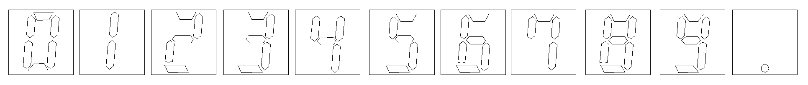
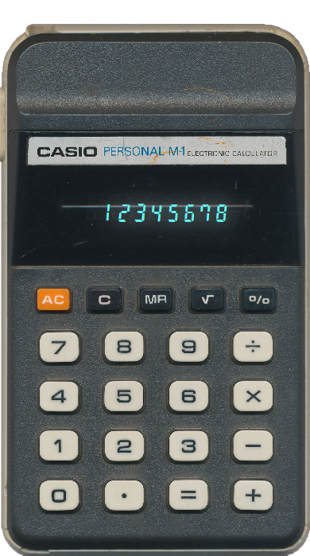
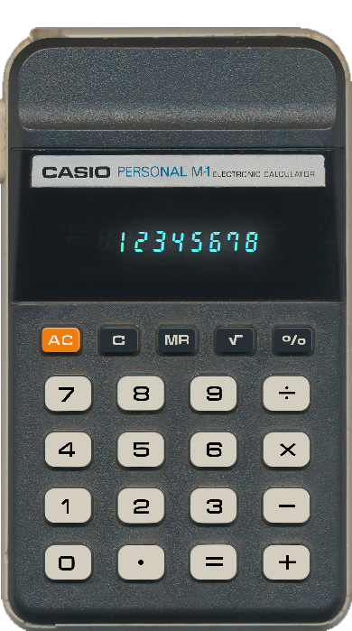

# 🧮 CalculatorJavaFX

A clean, retro-style desktop calculator built using Java and JavaFX, inspired by the Casio Personal M-1 calculator. This project bridges the gap between structured Java coursework and real-world GUI development — applying design, coding, and problem-solving skills into a fully functional, visually polished app.
- > ⚙️ This project is a faithful digital replica of my original, well-worn Casio M-1 calculator — scratches, dust, and all — rebuilt in JavaFX to preserve its unique character. (Major scratches interfering with the display and logo visibility were removed in Photoshop.)

## 🎯 Project Overview
- Transition from academic Java training into desktop GUI development
- Reinforce object-oriented principles and modular JavaFX design
- Develop practical GitHub workflow and open-source portfolio experience
- Showcase a retro calculator with precise UI, custom font, and LED-style glow effects

## ⚙️ Key Features
- ✅ Custom-designed CalculatorDigits.ttf font
- ✅ Decimal point manually spaced and aligned using FontForge
- ✅ LED-style display glow effect with duplicate label + drop shadow
- ✅ Accurate retro calculator layout using Scene Builder
- ✅ Clean window with fixed dimensions and custom icon
- ✅ GitHub-tracked learning and version control throughout

## 📐 Design Inspiration
- Based on the Casio Personal M-1 calculator — a personal keepsake
- All digits (0–9 and dot) were redrawn in CorelDRAW and converted to vector
- Final font manually kerned and spaced in FontForge for 1:1 alignment
- Display layered with StackPane for foreground + glow labels
- LED glow achieved using subtle Gaussian dropshadow in CSS

## 🔧 Technologies Used
- Java 21 (Azul ZuluFX JDK)
- JavaFX 21 (via GluonHQ SDK)
- IntelliJ IDEA CE 2024.1
- Scene Builder (for layout construction)
- CorelDRAW + FontForge (custom font design)
- Git & GitHub (version control and portfolio publishing)

## 🚀 How to Run

1. Clone the repository:
```bash
git clone https://github.com/aso-repos/CalculatorJavaFX.git
```

2. Open the project in IntelliJ IDEA

3. Configure JavaFX VM options:
```bash
--module-path "C:/Java/javafx-sdk-21/lib" --add-modules javafx.controls,javafx.fxml
```

4. Run `Main.java`

The calculator window will appear with LED-style display and turquoise digit glow.

## 🖼️ Visual Showcase

<p align="center">
  
  &nbsp; &nbsp; &nbsp;
  
</p>

- **Font Design Preview**  
  

<p align="center">
  
  &nbsp; &nbsp; &nbsp;
  
</p>

**Button Layout Detail**  
- Left: High-resolution scan of the original Casio Personal M-1 calculator
- Right: JavaFX recreation using Scene Builder and real JavaFX buttons  
  → Labels designed in CorelDRAW and exported as PNG  
  → Buttons styled with CSS for bevel and hover behavior  
  → Buttons are functional JavaFX elements, PNGs are for visual authenticity only

## 🎨 Styling and Visual Effects

All visual styling is managed through a dedicated CSS file:  
📄 `/resources/style.css`

Key highlights:
- Custom font applied to LED-style display with glow effect
- Distinct styling for orange, dark, and standard buttons
- Subtle shadows, bevels, and pressed states for realistic interaction

For full details, see the [style.css file](./resources/style.css)


## 🛠️ Development Roadmap
- ✅ Initial JavaFX calculator frame
- ✅ Custom font creation and embedding
- ✅ Digit/decimal alignment and glow overlay
- ✅ Button placement and PNG font overlays
- ✅ Interactive digit button input
- ✅ Add arithmetic operations (+, −, ×, ÷)
- ✅ Implement clear and backspace functionality
- ✅ Add keyboard support and button hover effects
- ✅ Integrate scientific and memory functions

## 📦 Installer and Release

This project has been exported as a `.jar` and packaged into an installable `.exe` using `jpackage`.  
The `.exe` is now available under the [GitHub Releases tab](../../releases).

⚠️ **Note:** Some antivirus software (e.g., AVG) may flag the installer during installation. This is expected for unsigned, newly built executables.  
_It is safe to install._

🟢 **Download the official installer**:  
➡️ [ASO.Calculator-1.0.exe](https://github.com/aso-repos/CalculatorJavaFX/releases/latest)

## 🎓 Learning Journey
This project is a culmination of:
- 📗 The Complete Java Development Bootcamp (Udemy – Learn The Part Inc., Rayan Slim, Jad Slim, Jose Portilla, Pierian Training)
- 📘 Java Specialization (Duke University / UC San Diego)
- 🎥 Bro Code’s JavaFX YouTube series
- 🛠️ Self-taught Git and open-source publishing
- ✏️ Custom font creation using CorelDRAW and FontForge

## 📚 Related Projects
- 🔁 BroCourse – JavaFX tutorial mirror project
- 🐍 Early Python UI Projects – Available in GitHub archive

## 👋 Contact
**Wessel Wessels**  
📫 LinkedIn: https://www.linkedin.com/in/wessel-wessels-9113191a/  
📁 GitHub: [aso-repos](https://github.com/aso-repos)

## 📄 License
Personal learning project — no license applied. The custom font “CalculatorDigits” was created by Wessel and is intended for non-commercial use.
