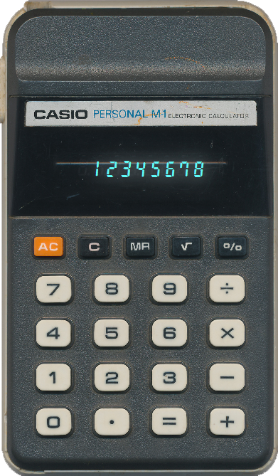

# 🧮 CalculatorJavaFX

A clean, retro-style desktop calculator built using Java and JavaFX, inspired by the Casio Personal M-1 calculator. This project bridges the gap between structured Java coursework and real-world GUI development — applying design, coding, and problem-solving skills into a fully functional, visually polished app.

## 🎯 Project Overview
- Transition from academic Java training into desktop GUI development
- Reinforce object-oriented principles and modular JavaFX design
- Develop practical GitHub workflow and open-source portfolio experience
- Showcase a retro calculator with precise UI, custom font, and LED-style glow effects

## ⚙️ Key Features
- ✅ Custom-designed CalculatorDigits.ttf font
- ✅ Decimal point manually spaced and aligned using FontForge
- ✅ LED-style display glow effect with duplicate label + drop shadow
- ✅ Accurate retro calculator layout using Scene Builder
- ✅ Clean window with fixed dimensions and custom icon
- ✅ GitHub-tracked learning and version control throughout

## 📐 Design Inspiration
- Based on the Casio Personal M-1 calculator — a personal keepsake
- All digits (0–9 and dot) were redrawn in CorelDRAW and converted to vector
- Final font manually kerned and spaced in FontForge for 1:1 alignment
- Display layered with StackPane for foreground + glow labels
- LED glow achieved using subtle Gaussian dropshadow in CSS

## 🔧 Technologies Used
- Java 21 (Azul ZuluFX JDK)
- JavaFX 21 (via GluonHQ SDK)
- IntelliJ IDEA CE 2024.1
- Scene Builder (for layout construction)
- CorelDRAW + FontForge (custom font design)
- Git & GitHub (version control and portfolio publishing)

## 🚀 How to Run

1. Clone the repository:

   ```bash
   git clone https://github.com/aso-repos/CalculatorJavaFX.git
   ```

2. Open the project in IntelliJ IDEA

3. Configure JavaFX VM options:

   ```bash
   --module-path "C:/Java/javafx-sdk-21/lib" --add-modules javafx.controls,javafx.fxml
   ```

4. Run `Main.java`

The calculator window will appear with LED-style display and turquoise digit glow.

<h4>🖼️ Visual Showcase</h4>

<p align="center">
  
  &nbsp; &nbsp; &nbsp;
  
</p>


## 🧱 Current Display Styling

```css
.digit-display {
    -fx-font-family: "CalcFont";
    -fx-font-size: 24px;
    -fx-text-fill: #61faf8;
}

.digit-glow {
    -fx-font-family: "CalcFont";
    -fx-font-size: 24px;
    -fx-text-fill: #61faf8;
    -fx-effect: dropshadow(gaussian, #e7ffff, 43, 0.03, 0, 0);
}
```

## 🛠️ Development Roadmap
- ✅ Initial JavaFX calculator frame
- ✅ Custom font creation and embedding
- ✅ Digit/decimal alignment and glow overlay
- ⬜ Interactive digit button input
- ⬜ Add arithmetic operations (+, −, ×, ÷)
- ⬜ Implement clear and backspace functionality
- ⬜ Add keyboard support and button hover effects
- ⬜ Integrate scientific and memory functions

## 🎓 Learning Journey
This project is a culmination of:
- 📘 Java Specialization (Duke University / UC San Diego)
- 🎥 Bro Code’s JavaFX YouTube series
- 🛠️ Self-taught Git and open-source publishing
- ✏️ Custom font creation using CorelDRAW and FontForge

## 📚 Related Projects
- 🔁 BroCourse – JavaFX tutorial mirror project
- 🐍 Early Python UI Projects – Available in GitHub archive

## 👋 Contact
**Wessel Wessels**  
📫 LinkedIn *(insert your link)*  
📁 GitHub: [aso-repos](https://github.com/aso-repos)

## 📄 License
Personal learning project — no license applied. The custom font “CalculatorDigits” was created by Wessel and is intended for non-commercial use.
